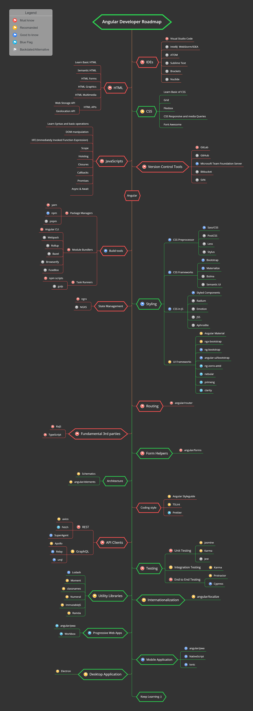

# Angular Developer Roadmap

> Roadmap to becoming a Angular developer in 2022:

Below you can find a chart demonstrating the paths that you can take and the libraries that you would want to learn to become a Angular developer. I made this chart as a tip for everyone who asks me, "What should I learn next as a Angular developer?"

## Disclaimer

> The purpose of this roadmap is to give you an idea about the landscape. The road map will guide you if you are confused about what to learn next, rather than encouraging you to pick what is hip and trendy. You should grow some understanding of why one tool would be better suited for some cases than the other and remember hip and trendy does not always mean best suited for the job

## Give a Star! :star:

If you like or are using this project to learn or start your solution, please give it a star. Thanks!

## Roadmap

## Resources

1. IDEs

    - [visualstudio](https://visualstudio.microsoft.com/downloads/)
    - [visualstudioCode](https://code.visualstudio.com/Download)

2. HTML

    - [w3schools](https://www.w3schools.com/html/) HTML Tutorial
    - [MDN Web Docs](https://developer.mozilla.org/en-US/docs/Web/HTML) HTML: HyperText Markup Language

3. CSS

    - [w3schools](https://www.w3schools.com/css/) CSS Tutorial
    - [MDN Web Docs](https://developer.mozilla.org/en-US/docs/Web/CSS) CSS: Cascading Style Sheets
    - [fontawesome](https://fontawesome.com/) Official website
    - [w3schools](https://www.w3schools.com/icons/icons_reference.asp) Icons Reference

4. JavaScript

    _Basic_

    - [w3schools](https://www.w3schools.com/js/default.asp) JavaScript Tutorial
    - [developer.mozilla](https://developer.mozilla.org/en-US/docs/Web/JavaScript) JavaScript
    - [javascript.info](https://javascript.info/) The Modern JavaScript Tutorial
    - [htmlcheatsheet](https://htmlcheatsheet.com/js/) JS CheatSheet

    _es6_

    - [exploringjs](https://exploringjs.com/es6/index.html) Exploring ES6
    - [es6-features](http://es6-features.org/#Constants) ECMAScript 6 — New Features: Overview & Comparison
    - [jsfeatures](https://jsfeatures.in) jsfeatures
    - [babeljs](https://babeljs.io/docs/en/learn) Learn ES2015
    - [github](https://github.com/lukehoban/es6features) ECMAScript 6
    - [github](https://github.com/sudheerj/ECMAScript-features) ECMAScript 6

    _Style Guide_

    - [github](https://github.com/airbnb/javascript) Airbnb JavaScript Style Guide
    - [github](https://github.com/ryanmcdermott/clean-code-javascript) clean-code-javascript

    _playground_

    - [js-array-playground](https://js-array-playground.firebaseapp.com/) JavaScript Array Playground
    - [jsfiddle](https://jsfiddle.net/)
    - [plnkr](https://plnkr.co/)
    - [jsbin](https://jsbin.com/?html,output)
    - [codepen](https://codepen.io/pen/)
    - [stackblitz](https://stackblitz.com/)

5. Angular

    - [official website](https://angular.io/)

6. Routing

    - [Angular-router](https://angular.io/guide/router)

7. Build Tools

    - Package Managers
        - [npm](https://www.npmjs.com/)
        - [yarn](https://yarnpkg.com/lang/en/)
        - [pnpm](https://pnpm.js.org/)
    - Module Bundlers
        - [angular-cli](https://angular.io/cli)
        - [Webpack](https://webpack.js.org/)
        - [Bazel](https://bazel.build/)
        - [Rollup](https://rollupjs.org/guide/en)
        - [Browserify](http://browserify.org/)
        - [FuseBox](https://fuse-box.org/)
    - Task Runners
        - [npm scripts](https://docs.npmjs.com/misc/scripts)
        - [gulp](https://gulpjs.com/)
        - [grunt](https://gruntjs.com/)

8. UI Design

    - CSS Preprocessor
        - [Sass/CSS](https://sass-lang.com/)
        - [PostCSS](https://postcss.org/)
        - [Less](http://lesscss.org/)
        - [Stylus](http://stylus-lang.com/)
    - CSS Frameworks
        - [Bootstrap](https://getbootstrap.com/)
        - [Materialize](https://materializecss.com/)
        - [Bulma](https://bulma.io/)
        - [Semantic UI](https://semantic-ui.com/)
    - CSS in JS
        - [Styled Components](https://www.styled-components.com/)
        - [Radium](https://formidable.com/open-source/radium/)
        - [Emotion](https://emotion.sh/)
        - [JSS](http://cssinjs.org/)
        - [Aphrodite](https://github.com/Khan/aphrodite)
    - UI Frameworks
        - [Angular Material](https://material.angular.io/) - Material Design components for Angular
        - [ngx-bootstrap](https://github.com/valor-software/ngx-bootstrap) Bootstrap widgets in Angular
        - [ng-bootstrap](https://github.com/ng-bootstrap/ng-bootstrap) Angular powered Bootstrap
        - [angular-ui/bootstrap](https://github.com/angular-ui/bootstrap) Angular powered Bootstrap
        - [ng-zorro-antd](https://ng.ant.design/docs/introduce/en) Angular UI component library based on Ant Design
        - [nebular](https://github.com/akveo/nebular) angular UI Library based on Eva Design System
        - [primeng](https://github.com/primefaces/primeng) Angular UI Component Library
        - [clarity](https://github.com/vmware/clarity) Angular components working together to craft exceptional experiences

9. API Clients

    - REST
        - [Fetch](https://developer.mozilla.org/en-US/docs/Web/API/Fetch_API)
        - [SuperAgent](https://visionmedia.github.io/superagent/)
        - [axios](https://github.com/axios/axios)
    - GraphQL
        - [Apollo](https://apollo-angular.com/docs/)
        - [Relay](https://facebook.github.io/relay/)
        - [urql](https://github.com/FormidableLabs/urql)

10. Fundamental 3rd parties

    - TypeScript
        - ["TypeScript Deep Dive"](https://github.com/basarat/typescript-book)
        - [Typescript Docs](https://www.typescriptlang.org/docs/)
    - RxJS
        - [The introduction to Reactive Programming](https://gist.github.com/staltz/868e7e9bc2a7b8c1f754)
        - [RxJS manual](http://reactivex.io/rxjs/manual/overview.html#introduction)
        - [RxJS In-Depth (video)](https://www.youtube.com/watch?v=KOOT7BArVHQ)

11. State Management

    - [ngrx](https://ngrx.io/)
    - [NGXS](https://ngxs.gitbook.io/ngxs/)

12. Architecture

    - [Schematics](https://www.npmjs.com/package/@angular-devkit/schematics)
    - [angular/elements](https://angular.io/guide/elements)

13. Coding style

    - [Angular Styleguide](https://angular.io/guide/styleguide)
    - [TSLint](https://palantir.github.io/tslint/)
    - [Prettier](https://prettier.io/)

14. Utility Libraries

    - [Lodash](https://lodash.com/)
    - [Moment](https://momentjs.com/)
    - [classnames](https://github.com/JedWatson/classnames)
    - [Numeral](http://numeraljs.com/)
    - [ImmutableJS](https://facebook.github.io/immutable-js/)
    - [Ramda](https://ramdajs.com/)

15. Testing

    - Unit Testing
        - [Jasmine](https://jasmine.github.io/)
        - [Karma](http://karma-runner.github.io/2.0/index.html)
        - [Jest](http://jestjs.io/)
    - E2E Testing
        - [Protractor](https://www.protractortest.org/#/)
        - [cypress.io](https://www.cypress.io/)
    - Integration Testing
        - [Karma](https://karma-runner.github.io/)

16. Internationalization

    - [angular/localize](https://angular.io/guide/i18n)

17. Progressive Web Apps

    - [angular/pwa](https://angular.io/guide/service-worker-getting-started)
    - [Workbox](https://developers.google.com/web/tools/workbox/)

18. Mobile Application Development

    - [NativeScript](https://www.nativescript.org/)
    - [Ionic](https://ionicframework.com/)

19. Desktop Application Development

    - [Angular Universal](https://universal.angular.io/)
    - [Electron](https://electronjs.org/)

## Contribution

If you want to contribute to this project to make it more helpful for other Angular developers, your help is very welcome!

Just file an issue, better yet: submit a PR! 🙂

## License

